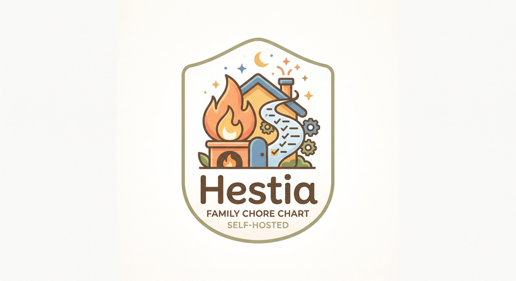

<p align="center">
  
</p>

# Hestia

A self-hosted household chore chart for families. Add your chores, assign
them (or let anyone claim them), check them off, and earn points — no
subscription, no cloud account, your data stays on your own server.

Hestia exists because most task trackers you'll find are built for software
teams, not families. It's meant to be free, simple, and something a
non-technical family member can actually use from a tablet on the fridge.

## Status

Early days — this is a fresh scaffold, not yet a usable app. See
[CLAUDE.md](./CLAUDE.md) for the project's conventions and current
architecture decisions.

## Planned features (v1)

- One instance can host multiple independent households with no
  cross-visibility — self-host for your own family, and optionally invite
  someone else to run their own household on the same instance
- Every household has a Head of Household (HoH) who manages it; anyone can
  have their own email/password login, or be a kid-friendly "managed
  profile" switched into via a tap-your-avatar picker on a shared screen,
  no password required
- Invite people in by email instead of sharing one login; managed profiles
  work too for kids without an email address
- Optional PIN per person for restricted actions
- Recurring chores (daily / weekly / custom schedule)
- Points and streaks per person
- Works well on a phone, a wall-mounted tablet, or a Raspberry Pi-hosted
  browser

## Tech stack

- [Go](https://go.dev) with [Gin](https://gin-gonic.com) and
  [GORM](https://gorm.io) for the backend API
- [React](https://react.dev) 19 + [Vite](https://vite.dev) + TypeScript for
  the frontend
- [Tailwind CSS](https://tailwindcss.com)
- [SQLite](https://sqlite.org) via GORM's `glebarez/sqlite` driver (pure Go,
  no cgo) — one file, no separate database server to run
- Docker, built for both amd64 and arm64 (Raspberry Pi / ARM NAS friendly)

## Running it (Docker)

```bash
git clone https://github.com/Wikid82/hestia.git
cd hestia
cp .env.example .env   # set AUTH_SECRET, and TZ to your household's timezone
docker compose up -d
```

The app will be available at `http://localhost:8080`. The SQLite database
lives in `./data/hestia.db` on the host, via a bind-mounted volume — back up
that one file to back up your whole household's data.

Set `TZ` to your household's IANA timezone (e.g. `America/New_York`) —
chore due-dates are computed from the container's local clock, so without
it everything runs on UTC regardless of where you actually are, and chores
flip to the next day at UTC midnight instead of local midnight.

The first account you sign up with becomes that household's HoH and this
instance's system admin. By default (`ALLOW_PUBLIC_SIGNUP=false`), nobody
else can self-signup after that — everyone else joins by invite, sent from
the admin/household settings screens once logged in. See
[`docs/environment.md`](./docs/environment.md) for every environment
variable, including the optional `SMTP_*`/`BASE_URL` ones needed to
actually send invite emails; without them, invites simply aren't
available yet, but everything else works.

For personal, host-specific overrides (a different data path, real SMTP
credentials, opening signup on your own instance) rather than editing
`docker-compose.yml` directly, copy `docker-compose.override.yml.example`
to `docker-compose.override.yml` — Compose merges it automatically, and
it's gitignored so your personal values never end up in a fork's history.

## Running behind a reverse proxy

Hestia works out of the box behind Caddy, Traefik, Nginx Proxy Manager, or
similar, as long as the proxy forwards the original `Host` header (all three
do this by default). Serving from a domain or subdomain root (e.g.
`https://hestia.example.com`) needs no extra configuration — just proxy to
the container's port 8080.

Serving Hestia from a reverse-proxy subpath (e.g.
`https://home.example.com/hestia/`) isn't supported yet — proxy from a
dedicated (sub)domain instead.

## Developing locally

Run the backend and frontend as two separate processes:

```bash
cd backend && cp ../.env.example ../.env  # or export AUTH_SECRET/DB_PATH/TZ directly
go run ./cmd/api
```

```bash
cd frontend
npm install
npm run dev
```

The Vite dev server proxies `/api` requests to the Go backend (see
`frontend/vite.config.ts`), so open the frontend's dev URL (typically
`http://localhost:5173`) rather than the backend's port directly.

Database migrations run automatically on startup via GORM's `AutoMigrate`.
After changing `backend/internal/models/models.go`, just restart the
backend — no separate migration-generation step needed.

### Git hooks

This repo uses [lefthook](https://github.com/evilmartians/lefthook) for local git hooks —
fast checks (`go vet`, `golangci-lint`, `tsc --noEmit`, `eslint`) before every commit, and a
full build+test before every push. One-time setup after cloning:

```bash
go install github.com/golangci/golangci-lint/v2/cmd/golangci-lint@latest
go install github.com/evilmartians/lefthook@latest
lefthook install
```

## License

[MIT](./LICENSE) — free for anyone to use, fork, or self-host.
